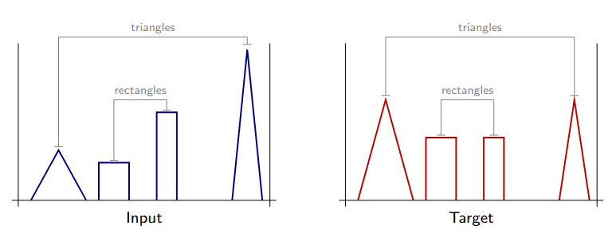
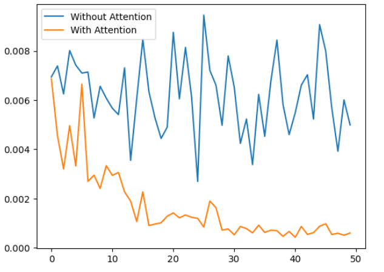

# Attention mechanism - intuition

The lecture notes on Deep Learning from [Francois Fleuret](https://fleuret.org/dlc/materials/dlc-handout-13-2-attention-mechanisms.pdf) contain a very nice intuition on why and where the attention mechanism works better than conv nets.

In the example, he considers a toy sequence-to-sequence problem with triangular and rectangular shapes with random heights as input.
The expected target contains the same shapes but with their heights averaged, as in the figure below.

Since there was no source code available in his lecture (as far as I know), I have tried to reproduce the same intuition in this notebook.
As we can see, with the exact training procedure, the attention mechanism is able to learn the task much faster than the conv net.
The conv net model's poor performance is expected due to its inability to look far away the input signal to learn the task.
There are plenty of mechanisms we can equip the conv net with to make it work better (more layers, fully connected layers, ...), but the attention mechanism is a very simple and elegant solution to this problem.

I hope you find this notebook useful and that Professors Fleuret don't mind me using their example.

